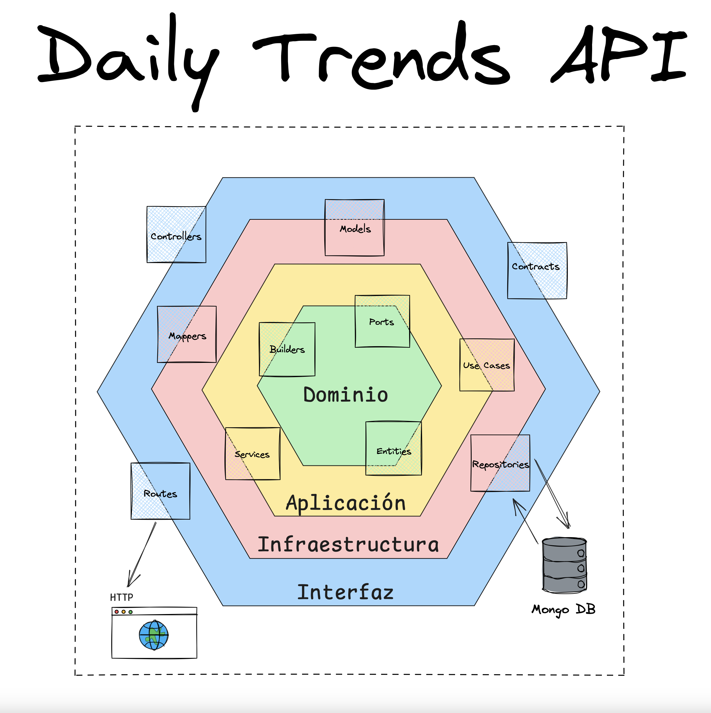

# Daily Trends MS

## Descripción del Proyecto

**DailyTrends** es una API desarrollada en TypeScript que proporciona un feed de noticias, consolidando portadas de diferentes periódicos en un solo lugar. La API está diseñada para mostrar las 5 principales noticias del día de los periódicos **El País** y **El Mundo**. Además, permite añadir noticias manualmente a través de la API.

## Tareas Realizadas

1. **Configuración del Proyecto:**
   - Creación de un proyecto TypeScript con una estructura de ficheros organizada.
   - Configuración del entorno de desarrollo y las dependencias necesarias.

2. **Modelo de Datos:**
   - Definición del modelo **Feed** con sus atributos correspondientes.
   - Utilización de **MongoDB** como origen de datos, empleando un **ODM** para la gestión de la base de datos.

3. **Endpoints del API:**
   - Implementación de endpoints para gestionar los servicios CRUD del modelo **Feed**.
   - Desacoplamiento de las capas del API para una mayor modularidad y mantenimiento.

4. **Servicio de Lectura de Feeds:**
   - Creación de un servicio que realiza web scraping para extraer las noticias de portada de **El País** y **El Mundo**.
   - Integración del servicio con el modelo **Feed** para almacenar y gestionar las noticias obtenidas.
   - Implementación de conceptos de orientación a objetos para manejar la complejidad del scraping.

## Instalación y Uso

Para ejecutar el proyecto, asegúrate de tener Docker y Docker Compose instalados. Luego, sigue estos pasos:

1. **Clona el repositorio:**
   ```bash
   git clone <URL_DEL_REPOSITORIO>
   cd daily-trends-ms

2. **Construye y ejecuta los contenedores con Docker Compose:**
   ```bash
   docker compose up --build

3. **Accede a la API:**
   - La API estará disponible en [http://localhost:8080/api-docs#/](http://localhost:8080/api-docs#/). Puedes consultar la documentación de la API en esta URL para explorar los endpoints disponibles y probar las funcionalidades.

## Infraestructura

El diagrama a continuación ilustra la infraestructura del proyecto, mostrando la interacción entre los diferentes componentes y servicios.




